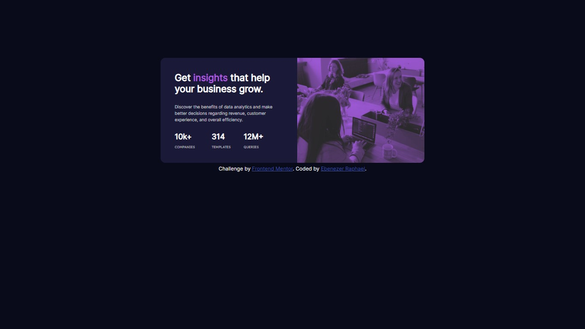

# Frontend Mentor - Stats preview card component solution

This is a solution to the [Stats preview card component challenge on Frontend Mentor](https://www.frontendmentor.io/challenges/stats-preview-card-component-8JqbgoU62). Frontend Mentor challenges help you improve your coding skills by building realistic projects. 

## Table of contents

- [Overview](#overview)
  - [The challenge](#the-challenge)
  - [Screenshot](#screenshot)
  - [Links](#links)
- [My process](#my-process)
  - [Built with](#built-with)
  - [What I learned](#what-i-learned)
  - [Useful resources](#useful-resources)
- [Author](#author)

## Overview

### The challenge

Users should be able to:

- View the optimal layout depending on their device's screen size

### Screenshot



### Links

- Solution URL: [GitHub](https://www.github.com/ebenezerraph/stats-preview-card-Ccomponent/)
- Live Site URL: [Stats Preview Card Component](https://ebenezerraph.github.io/stats-preview-card-component/)

## My process

### Built with

- Semantic HTML5 markup
- CSS custom properties

### What I learned

Well, I learned how to add a filter to an image using CSS!

```css
img {
    filter: grayscale(100%) brightness(35%) sepia(100%) hue-rotate(-130deg) saturate(600%) contrast(0.69);
}
```

### Useful resources

- [HTML & CSS: Design and Build Web Sites - Book by Jon Duckett](https://www.htmlandcssbook.com/) - This helped me to address minor issues in my code and I will use it going forward.
- [FreeCodeCamp](https://forum.freecodecamp.org/) - This amazing forum helped me finally understand how to add filters to an image. I'd recommend it to anyone who needs help understanding certain concepts.

## Author

- GitHub - [@ebenezerraph](https://www.github.com/ebenezerraph)
- Frontend Mentor - [@ebenezerraph](https://www.frontendmentor.io/profile/ebenezerraph)
- Twitter - [@ebenezerraph](https://www.twitter.com/ebenezerraph)
